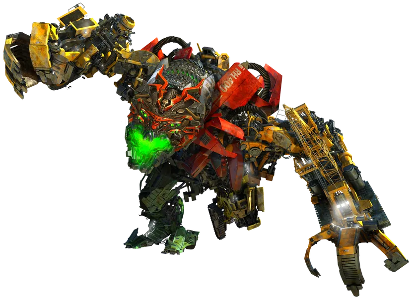

# Decepticons

<p align="center">
  
</p>

O(n) attention is deception. Shared kernel for non-transformer predictive descendants.

`decepticons` extracts reusable model mechanisms from a broader
experiment family so downstream systems can specialize without forking the
kernel itself.

## What It Does

`decepticons` provides the mechanism layer:

- reusable substrates and memory primitives
- controller summaries, gates, routing, and modulation
- reusable readout and feature-view building blocks
- lightweight runtime and evaluation helpers
- backend-neutral family metadata and deterministic substrate builders, such as
  `decepticons.causal_bank`
- export helpers and contracts for descendant systems

It is intentionally not a full runtime system:

- no fleet orchestration
- no benchmark-specific policy
- no packed-artifact economics
- no external evidence or audit packaging

That work belongs in descendants such as `chronohorn`.

## Install

```bash
python3 -m pip install -e .
```

Quick start:

```bash
python3 -m venv .venv
source .venv/bin/activate
pip install -e .
python3 examples/quickstart.py
```

## CLI

```bash
opc fit --input ./corpus.txt --prompt "predictive " --generate 80
```

## Python

```python
from decepticons import ByteCodec, ByteLatentPredictiveCoder

text = "predictive coding likes repeated structure.\n" * 64
model = ByteLatentPredictiveCoder()
fit_report = model.fit(text)

prompt = ByteCodec.encode_text("predictive ")
sample = model.generate(prompt, steps=40, greedy=True)

print(fit_report.train_bits_per_byte)
print(ByteCodec.decode_text(sample))
```

## Architecture

The intended ecosystem split is:

```text
decepticons -> chronohorn -> heinrich
kernel                 runtime       evidence / audit
```

Ownership is simple:

- `decepticons`
  - family-neutral predictive mechanisms
  - reusable substrate, memory, control, and readout primitives
  - backend-neutral family metadata
  - export ABI helpers
- `chronohorn`
  - training, replay, scoring, fleet execution, and runtime observation
- `heinrich`
  - external validation, evidence packaging, and audit compression

## Kernel Boundary

What belongs in the kernel:

- substrate dynamics
- predictive and exact-context memory primitives
- controller summaries, gating, routing, and modulation
- reusable readouts and feature views
- lightweight runtime and evaluation helpers
- export-friendly deterministic family/config surfaces

What does not belong in the kernel:

- one descendant's training recipe
- one descendant's artifact format
- one descendant's leaderboard or frontier story
- one descendant's legality or audit policy
- one descendant's fleet/runtime orchestration

If a mechanism can be named without reference to a specific descendant and used
unchanged by more than one downstream system, it belongs here. Otherwise it
stays in the descendant.

## Modules

- `substrates`
  - recurrent, delay, linear-memory, oscillatory-memory, mixed-memory, and hierarchical substrate primitives
- `control`, `controllers`, `gating`, `routing`, `modulation`
  - reusable controller-side mechanisms
- `exact_context`, `ngram_memory`, `statistical_backoff`
  - causal memory primitives
  - `OnlineCausalMemory` — runtime n-gram accumulator with 7-feature query interface
- `views`, `hierarchical_views`, `linear_views`
  - feature and summary views
- `readouts`, `experts`
  - reusable readout surfaces (now includes GRU recurrent readout)
- `causal_bank`
  - backend-neutral causal-bank family metadata and deterministic substrate construction
  - new config fields: `substrate_mode`, `memory_kind`, `num_blocks`, `block_mixing_ratio`,
    `block_stride`, `state_dim`, `num_heads`, `patch_size`, `patch_causal_decoder`,
    `num_hemispheres`, `fast_hemisphere_ratio`, `fast_lr_mult`, `local_poly_order`,
    `substrate_poly_order`, `training_noise`, `adaptive_reg`
  - `learnable_substrate_keys()` helper
  - chunked parallel scan for `learned_recurrence` substrate mode
- `bridge_export`, `oracle_analysis`, `teacher_export`
  - descendant-facing boundary helpers
- `runtime`, `eval`, `train_eval`, `artifacts`
  - lightweight runtime and evaluation support

## Docs

- [docs/architecture.md](./docs/architecture.md)
  - package and layer map
- [docs/kernel_matrix.md](./docs/kernel_matrix.md)
  - extraction roadmap and primitive matrix
- [docs/CHRONOHORN_KERNEL_BOUNDARY.md](./docs/CHRONOHORN_KERNEL_BOUNDARY.md)
  - boundary between the kernel and the Chronohorn runtime system
- [docs/EXPORT_ABI.md](./docs/EXPORT_ABI.md)
  - draft `opc-export` contract
- [docs/downstream_patterns.md](./docs/downstream_patterns.md)
  - causal, noncausal, oracle, bridge, and byte-latent descendant patterns
- [docs/lineage.md](./docs/lineage.md)
  - source lineage and attribution
- [examples/README.md](./examples/README.md)
  - example descendants and dev tools
- [tests/README.md](./tests/README.md)
  - verification surface

## Scope

This is a research kernel and reference implementation.

It is not:

- a frontier runtime system
- a production compression stack
- a benchmark claim
- a complete reproduction of every descendant in the broader workspace

It exists to keep the shared mechanism layer reusable and legible.

## License

MIT
